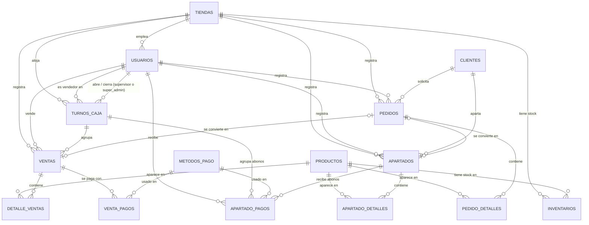

# Matrix — POS para tienda de ropa

Sistema de punto de venta (POS) web para una tienda de ropa, pensado para operar en varias sucursales compartiendo el mismo inventario y las mismas ventas. Incluye un panel administrativo (`/admin`) exclusivo para super-admins.

## Contexto y alcance

- Arranca con 1 tienda; está pensado para escalar a 3+ sucursales.
- Siempre hay conexión a internet (no se requiere modo offline).
- Por ahora no usa hardware especial (sin impresora de tickets ni lector de código de barras dedicado), aunque el flujo de ventas ya está preparado para leer un código de barras desde cualquier lector tipo teclado (HID).
- Se despliega en AWS con Docker. Base de datos: MySQL.
- Sin ORM: las tablas se crean y modifican con scripts SQL (`db/schema.sql`), y la app ejecuta SQL directo contra MySQL con parámetros (`%s`), nunca concatenando valores.

## Stack tecnológico

| Capa | Tecnología | Notas |
|---|---|---|
| Backend | Python + Flask | Microframework: petición → consulta SQL → plantilla. Sin Django/ORM. |
| Acceso a datos | PyMySQL | Conexión directa a MySQL, sin capa de abstracción. |
| Autenticación | `werkzeug.security` (`generate_password_hash` / `check_password_hash`) + `flask.session` | Sesión firmada por cookie, sin tabla de sesiones propia (ver [Roles y sesión](#roles-y-sesión)). |
| Frontend | Jinja2 + Bootstrap 5 | Páginas completas renderizadas en el servidor. |
| Interactividad | HTMX + `fetch` JS | El carrito de ventas y el corte de caja se resuelven con `fetch` a endpoints JSON; el resto de fragmentos dinámicos usa HTMX (ver `_productos_tabla.html`). |
| Base de datos | MySQL 8 en contenedor Docker | Persistencia en un volumen (`db_data`), no RDS. |
| Contenedores | `docker-compose` (`web` + `db`) | Pensado para correr con `docker-compose` directo sobre una instancia EC2. |

## Cómo correr el proyecto

1. Copiar `.env` con las variables `DB_HOST`, `DB_USER`, `DB_PASSWORD`, `DB_NAME`, `DB_ROOT_PASSWORD` (y opcionalmente `SECRET_KEY`, usada para firmar la cookie de sesión).
2. Levantar los contenedores:

```bash
docker-compose up -d --build
```

3. La primera vez que se crea el volumen de `db`, MySQL ejecuta automáticamente `db/schema.sql` (tablas + datos de prueba). Si el volumen ya existe, `schema.sql` **no** se vuelve a ejecutar solo por reiniciar el contenedor — hay que aplicar los cambios a mano (ver más abajo) o borrar el volumen (`docker-compose down -v`, destructivo) para recrearlo desde cero.
4. La app queda disponible en `http://localhost:5000`.

### Aplicar cambios de esquema a una base ya existente

Como `schema.sql` solo corre en la creación inicial del volumen, cualquier cambio posterior a la estructura (una tabla o columna nueva) se aplica a mano contra el contenedor de MySQL, por ejemplo:

```bash
docker exec -i matrix-db-1 mysql -u<usuario> -p<password> <base_de_datos> < ruta/al/cambio.sql
```

## Estructura del proyecto

```
matrix/
├── app/
│   ├── __init__.py        # create_app(): fábrica de la aplicación Flask, registra blueprints
│   ├── config.py          # Config: variables de entorno (DB_*, SECRET_KEY, VERSION)
│   ├── db.py               # get_connection() / db_cursor(): acceso a MySQL con PyMySQL
│   ├── auth.py             # decoradores requiere_rol / turno_required (control de acceso)
│   ├── permisos.py         # Rol (enum): vendedor, supervisor, super_admin
│   ├── blueprints/         # una ruta por archivo, agrupadas por dominio
│   │   ├── core.py          # "/" (redirección según sesión), /health
│   │   ├── auth.py          # /login, /logout — solo super_admin y supervisor
│   │   ├── caja.py          # /caja/abrir, /caja/corte (apertura y cierre de turno)
│   │   ├── productos.py     # /productos — inventario de solo lectura (POS, turno abierto)
│   │   ├── apartados.py     # /apartados — ver, crear, abonar y entregar (POS, turno abierto)
│   │   ├── pedidos.py       # /pedidos — ver, crear y convertir a venta/apartado (POS, turno abierto)
│   │   ├── ventas.py        # /ventas, /ventas/buscar, /ventas/finalizar (POS, turno abierto)
│   │   └── admin.py         # /admin/* — dashboard, productos, usuarios, tiendas, pedidos, apartados (solo super_admin)
│   ├── templates/           # Jinja2 (Bootstrap + HTMX); templates/admin/ para el panel
│   └── static/              # CSS
├── db/
│   └── schema.sql           # esquema completo + datos de prueba
├── wsgi.py                  # punto de entrada (flask run lo detecta solo)
├── requirements.txt
├── Dockerfile
└── docker-compose.yml
```

Para añadir una sección nueva al POS: crear `app/blueprints/<nombre>.py`, registrarlo en `app/__init__.py`, agregar su plantilla, y decorar sus rutas con `@turno_required` (accesible mientras haya una caja abierta en la terminal, sin distinción de rol). Para una sección nueva de `/admin`, agregar la ruta dentro de `app/blueprints/admin.py` — el `before_request` del blueprint ya exige `rol == super_admin` para todo lo que cuelgue de `/admin`.

## Roles y sesión

Hay tres roles (`app/permisos.py`): **vendedor**, **supervisor** y **super_admin**.

**Solo supervisor y super_admin tienen usuario y contraseña.** vendedor es un registro sin contraseña (`usuarios.password_hash IS NULL`) — existe para poder decir "esta venta la hizo tal persona" y para que se le asigne una caja, pero nunca inicia sesión por sí mismo.

Una terminal está en uno de dos estados, independientes entre sí, guardados en la cookie de sesión de Flask:

1. **Sesión de usuario** (`session['usuario_id']`, `session['rol']`) — la deja un login de supervisor/super_admin. Solo sirve para abrir una caja o entrar a `/admin` (si es super_admin).
2. **Turno de caja abierto** (`session['turno_id']`) — habilita Ventas, Inventarios, Pedidos y Apartados en el POS, sin importar el rol de quien esté operando la terminal. `turno_required` no revisa `session['rol']` en absoluto.

Abrir una caja (`session.clear()` + `session['turno_id']`) destruye la sesión de usuario de esa terminal — por diseño: una vez que una terminal es la caja de un vendedor, deja de ser la sesión de quien la autorizó.

El flujo completo:

1. Un supervisor o super_admin entra a `/login` con usuario y contraseña.
2. Cae directo en **Abrir caja** (`/caja/abrir`) — una pantalla sin menú, igual que el login.
   - Un **super_admin** elige: asignar la caja a un vendedor disponible, o **vender él mismo**.
   - Un **supervisor** está forzado a asignar un vendedor — no puede vender él mismo (regla de negocio).
   - En ambos casos se captura tienda y fondo inicial.
3. Al confirmar, se crea una fila en `turnos_caja` y la terminal pasa a modo Ventas.
4. Mientras el turno siga abierto, ese mismo usuario (vendedor o el super_admin que se autoasignó) no puede tener otro turno abierto en ninguna otra tienda — restricción a nivel de base de datos (ver más abajo).
5. Para cerrar: el botón **Cerrar caja** en la pantalla de Ventas pide usuario/contraseña de un supervisor o super_admin ahí mismo (candado inline, sin navegar) y, si son válidos, calcula fondo inicial + efectivo vendido (ventas **y** abonos de apartados en efectivo) vs. efectivo contado, la diferencia, y cierra el turno.
   - Si quien vendió fue el propio super_admin, él mismo puede autorizar su corte — es el dueño, no tiene sentido exigir que otra persona lo verifique.
   - Si vendió un vendedor, lo cierra cualquier supervisor o super_admin, no necesariamente quien lo abrió.
6. Al cerrar, la terminal se limpia y vuelve a `/login`.

**Cómo se evita que un vendedor (o un super_admin vendiendo) tenga dos turnos abiertos a la vez:** `turnos_caja` tiene una columna generada:

```sql
usuario_si_abierto INT AS (IF(estado = 'abierto', usuario_id, NULL)) STORED,
UNIQUE KEY uq_turno_usuario_abierto (usuario_si_abierto)
```

Como MySQL permite múltiples `NULL` en una columna con índice único, esta columna vale `NULL` para cualquier turno ya cerrado (sin restricción) y vale el `usuario_id` solo cuando el turno está `abierto`. Así, la base de datos rechaza por sí sola el intento de insertar un segundo turno abierto para el mismo usuario, sin importar desde qué tienda o quién lo intente.

**`/admin`** es un blueprint aparte, con su propio `before_request` que exige `session['rol'] == 'super_admin'` — no depende de ningún turno. Un super_admin sin turno abierto (recién logueado) puede entrar directo; si su terminal tiene un turno activo, perdió su sesión de usuario al abrirlo (punto 3 arriba) y tiene que loguearse de nuevo para volver a `/admin`.

## Base de datos

### Diagrama de relaciones



### Tablas

**`tiendas`** — catálogo de sucursales.
| columna | tipo | descripción |
|---|---|---|
| id | PK | |
| nombre, direccion | | |
| activo | bool | una tienda inactiva no aparece como opción al vender, abrir caja, etc. |

**`usuarios`** — vendedores, supervisores y super-admins de todas las tiendas.
| columna | tipo | descripción |
|---|---|---|
| id | PK | |
| tienda_id | FK → tiendas | tienda "base" del usuario (informativo; supervisor/super_admin pueden abrir cajas en cualquier tienda) |
| nombre, usuario_login | | `usuario_login` es único |
| password_hash | nullable | **NULL para vendedor.** Solo supervisor y super_admin inician sesión. |
| rol | enum | `vendedor` \| `supervisor` \| `super_admin` |
| activo | bool | |

**`productos`** — catálogo. Cada combinación talla/color es su propia fila (no hay tabla de variantes aparte).
| columna | tipo | descripción |
|---|---|---|
| id | PK | |
| nombre, talla, color, precio | | |
| codigo_barras | único, nullable | se busca por aquí en el punto de venta |
| activo | bool | un producto descontinuado deja de aparecer en ventas/inventario |

**`inventarios`** — stock de cada producto **por tienda** (una fila por combinación tienda+producto).
| columna | tipo | descripción |
|---|---|---|
| tienda_id | FK → tiendas | |
| producto_id | FK → productos | |
| cantidad | int, `>= 0` (CHECK) | par único con `tienda_id` |

**`turnos_caja`** — apertura/cierre de caja (ver [Roles y sesión](#roles-y-sesión)).
| columna | tipo | descripción |
|---|---|---|
| id | PK | |
| tienda_id | FK → tiendas | dónde opera el turno |
| usuario_id | FK → usuarios | quién vende (vendedor o el propio super_admin) |
| abierto_por / cerrado_por | FK → usuarios, nullable el segundo | supervisor/super_admin que autorizaron apertura y cierre (pueden ser distintos) |
| fondo_inicial / fondo_final | decimal | efectivo con el que abre / con el que se cuenta al cerrar |
| estado | enum | `abierto` \| `cerrado` |
| fecha_apertura / fecha_cierre | datetime | |
| notas_cierre | texto libre | |

**`ventas`** — una fila por venta cerrada.
| columna | tipo | descripción |
|---|---|---|
| tienda_id | FK → tiendas | |
| usuario_id | FK → usuarios | quien la hizo |
| turno_id | FK → turnos_caja, nullable | a qué turno pertenece (para calcular el corte) |
| fecha, total | | |

**`detalle_ventas`** — líneas de producto de cada venta. `subtotal` es columna generada (`cantidad * precio_unitario`).

**`metodos_pago`** — catálogo compartido por `venta_pagos` y `apartado_pagos`: `efectivo`, `transferencia`, `TC/TD`, `otro`.

**`venta_pagos`** — permite pagar una venta con más de un método (ej. mitad efectivo, mitad tarjeta). El corte de caja suma aquí los pagos en `efectivo` de cada turno.

**`clientes`** — catálogo global de clientes (no pertenecen a una tienda en particular), usado por apartados y pedidos.

**`apartados`** — cabecera de un apartado (producto físicamente en tienda, retenido para un cliente). Al apartar, las piezas **salen del inventario** de la tienda. Estados: `activo`, `liquidado` (pagado, sin entregar), `entregado` (`fecha_entrega`), `cancelado`, `vencido` (estos dos solo los pone `/admin`). En el POS se ven como **vigente** (≤ 3 meses desde `fecha_creacion`), **expirado** (> 3 meses: ya no admite abonos ni entrega; un administrador regresa sus piezas al inventario con `POST /admin/apartados/<id>/devolver_inventario`, que lo deja `vencido` y conserva los abonos registrados), **entregado** o cancelado; la vigencia se calcula al consultar, no cambia `estado` por sí sola. Los registros no se eliminan desde el POS.

**`apartado_detalles`** — productos incluidos en el apartado (misma lógica de `subtotal` generado que `detalle_ventas`).

**`apartado_pagos`** — historial de abonos. `turno_id` (nullable) liga el abono al turno en que se recibió, para que el corte de caja lo sume igual que `venta_pagos`. `metodo_pago_id` referencia el mismo catálogo `metodos_pago` que usan las ventas.

**`v_apartados_resumen`** — vista de solo lectura que junta cada apartado con su cliente, total abonado, saldo pendiente y dos banderas calculadas (`mayor_a_3_meses`, `vencido_por_fecha_limite`).

**`pedidos`** — cabecera de un pedido (mercancía que la tienda no tiene y va a conseguir con el proveedor para un cliente). Estados: `pendiente` → `disponible` → `entregado`, o `cancelado` en cualquier punto antes de `entregado`. Solo `/admin` puede mover `pendiente → disponible` o cancelar. **La mercancía de un pedido no entra al inventario**: al llegar queda reservada para el cliente (si entrara, una venta normal podría llevársela). Por eso entregarlo como venta no descuenta existencias, y cancelar un pedido `disponible` sí suma sus piezas al inventario de la tienda para que se puedan vender. Un pedido `disponible` se convierte en una venta o un apartado desde el POS — `venta_id`/`apartado_id` (mutuamente excluyentes, `CHECK`) registran en cuál, y el estado pasa a `entregado`.

**`pedido_detalles`** — productos solicitados en el pedido. Cada línea es **del catálogo** (`producto_id`) o **fuera de catálogo**: el cajero solo conoce una descripción genérica y la talla porque la prenda viene del catálogo del proveedor (`producto_id` NULL, `descripcion`, `talla`). Ambas pueden llevar un `comentario` ("puede ser roja o negra"). Cuando llega la mercancía, `/admin` asigna cada línea fuera de catálogo a un producto real con `PUT /admin/pedidos/<id>/detalles/<detalle_id>` (si no existe, primero se da de alta); hasta entonces el pedido no puede marcarse `disponible`, porque sin producto no hay precio para cobrarlo. Cambio aplicado con `db/migraciones/001_pedidos_fuera_de_catalogo.sql`.

## Rutas principales

| Ruta | Blueprint | Quién puede entrar | Qué hace |
|---|---|---|---|
| `/` | core | cualquiera | redirige según la sesión (turno → Ventas, usuario → Abrir caja, nadie → Login) |
| `/login`, `/logout` | auth | público | autenticación de supervisor/super_admin |
| `/caja/abrir` | caja | supervisor, super_admin | abre un turno (asignado a un vendedor, o el propio super_admin vendiendo) |
| `/caja/corte` | caja | credenciales de supervisor/super_admin en el momento | cierra el turno activo de la terminal, suma ventas + abonos de apartados en efectivo |
| `/ventas`, `/ventas/buscar`, `/ventas/buscar_nombre`, `/ventas/finalizar` | ventas | turno abierto | pantalla de venta: buscar producto por código de barras o por nombre, cobrar, descontar inventario |
| `/productos` | productos | turno abierto | inventario de solo lectura, mismo listado para los 3 roles |
| `/pedidos`, `/pedidos/nuevo`, `/pedidos/<id>/convertir_venta`, `/pedidos/<id>/convertir_apartado` | pedidos | turno abierto | ver, registrar y convertir pedidos `disponible` en venta o apartado |
| `/apartados` (GET, POST), `/apartados/<id>/abonar`, `/apartados/<id>/entregar` | apartados | turno abierto | ver apartados (con productos y abonos), apartar productos con anticipo opcional, abonar (en cualquier tienda) y entregar (solo en su tienda; cobra el saldo, con cambio si es en efectivo) |
| `/admin/*` | admin | super_admin | dashboard, alta/edición de productos e inventario, alta/baja de usuarios y tiendas, aprobar/cancelar pedidos, ver apartados |

## Datos de prueba (solo entorno de desarrollo)

`db/schema.sql` inserta datos dummy, incluyendo estos usuarios con contraseña (`admin123` para ambos):

| usuario_login | nombre | rol | tienda |
|---|---|---|---|
| admin_centro | Ana Superadmin | super_admin | Tienda Centro |
| admin_norte | Diego Supervisor | supervisor | Tienda Norte |

Los vendedores de prueba (`cajero_centro`, `cajero_norte`) no tienen contraseña — se seleccionan por nombre al abrir caja.

## Simplificaciones deliberadas (pendientes de revisar con negocio)

- **`pedidos.convertir_apartado`** crea el apartado con `anticipo_requerido = 0` y `fecha_limite` a 3 meses fijos — no pide esos datos en el momento.
- La conversión de un pedido a venta/apartado solo se permite desde una terminal cuyo turno sea de la **misma tienda** que el pedido (la mercancía reservada está físicamente ahí) — si se intenta desde otra tienda, se rechaza con un mensaje.
- No hay pantalla para dar de alta/editar `clientes` de forma independiente; se crean sobre la marcha al registrar un pedido con "cliente nuevo".

## Próximos pasos sugeridos

- Reporte histórico de cortes de caja (hoy `turnos_caja` guarda todo lo necesario, falta la pantalla de consulta).
- Lector de código de barras USB (HID) e impresión de tickets — no bloqueante, se integran sin cambiar el modelo de datos actual.
- Revisar las simplificaciones de la sección anterior si el negocio las necesita completas.
